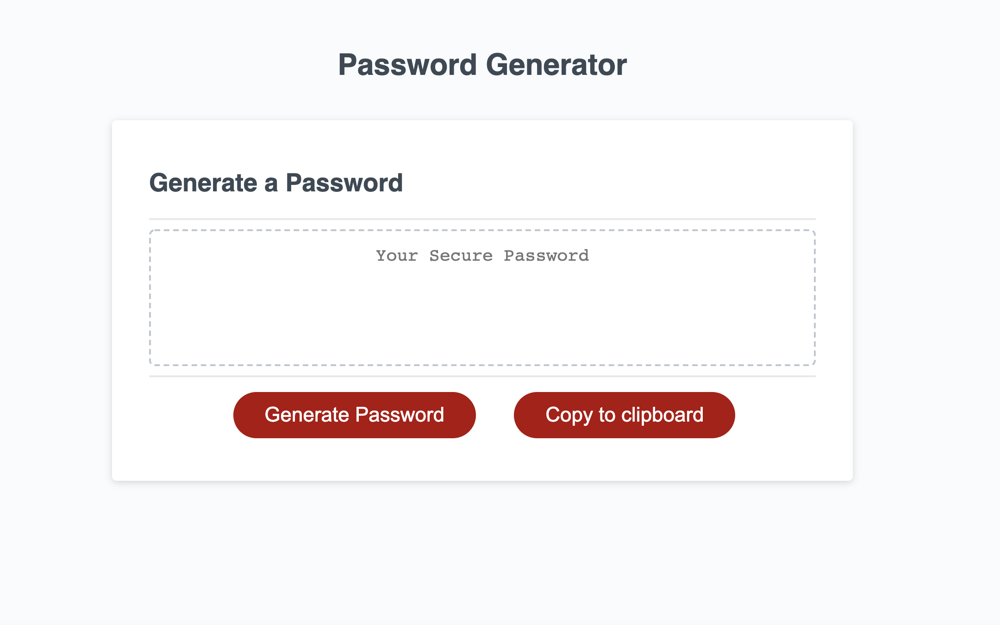

# random-password-generator
For this homework assignment we were tasked with generating a random password. We had to include some criteria for our password like if you want a certain length, uppercase charcters, lowercase characters, numbers, or special characters to be included in the password.

REPOSITORY PAGE:
https://github.com/slimeforest/random-password-generator

LIVE PAGE:
https://slimeforest.github.io/random-password-generator/

IMAGES

